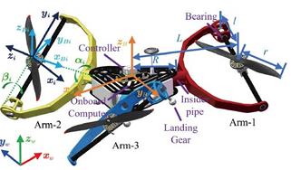

# 秦梓杰 24-25
## 结合视觉与磁场的四旋翼空中对接系统
*背景*
- 无人机需要停在空中 perching 精度不够 解决精确度
- 机械结构的方案有磨损，且成本大，系统复杂。定位还是得用UWB和动捕
*贡献*
- 建立用于控制四旋翼无人机的磁场模型，搭建测试架，拟合磁场模型函数
- 设计基于磁场模型的QP来重新分配推力
*未来*
- 移动中的高精度对接
- 开发可变磁场处理分离操作
## 分布式螺旋桨滑流对机翼的影响分析与建模 ICMIC
- 
## 基于磁矢量场设计并优化的无人机空中精确对接系统 CCC
- 和第一篇几乎一样，没有视觉元素，所以没有传感器数据融合部分
## 带线性伺服电机的 tilt-rotor 控制
*背景*
- 传统构型位置与姿态的控制紧耦合
- 现有研究给每个旋翼配一个伺服电机，增加了载重
*贡献*
- 四旋翼，只配两个线性伺服电机，通过连杆分别控制同侧的两个旋翼
- 通过迭代的方法更新旋翼倾角，最终收敛至控制目标
*未来*
- 没有实物实验
## 一种新型过驱动三旋翼无人机：建模、控制与验证
*背景*
- 三旋翼构型效率更高，但是由于其桨叶不对称性，无法自然抵消扭矩
*贡献*
- 提出了新的构型

- 针对螺旋浆的反扭距，采用前馈的方式进行预测抵消
- 针对伺服反扭矩和陀螺力矩难以精确建模，视为集总干扰，结合QP实时分配推力进行抵消
*未来*
- 没做实机实验
## 通过补偿倾转角度的动力学来提高倾转旋翼八旋翼机的控制器性能
## 混合模式：作为复合垂直起降无人机第三种常见模式的过渡模式常规化